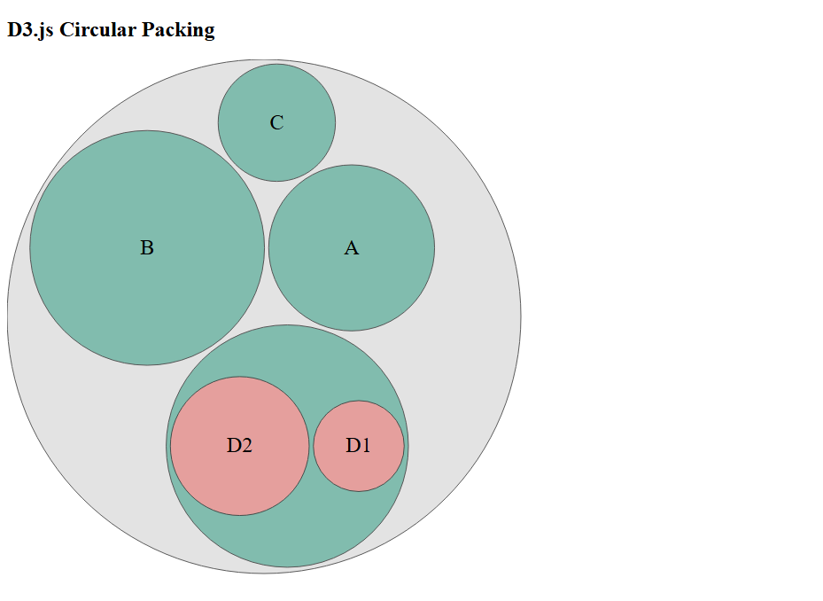

d3r: Data-Driven Documents (D3) in R Ecosystem
================

## Introduction

<div style="display: flex; align-items: center;">


</div>

</br>

`d3r` is an R package designed to seamlessly integrate D3.js into your R
ecosystem, enabling dynamic and interactive data visualizations. Whether
you’re working in RStudio, Shiny, Quarto, Jupyter, Selenium, or plain
HTML, `d3r` provides an easy way to create, embed, and interact with
D3.js-based charts, graphs, and visualizations without needing deep
JavaScript knowledge.

# Installation

``` r
devtools::install_github("JacekPardyak/d3r", upgrade = "never")
```

## Usage

In these usage examples, we use `Selenium` mode to take screenshots of
documents generated by D3.js. Check the `tests` folder for additional
live examples in different modes. This `d3r`
[showcase](https://jacekpardyak.github.io/d3r/) in `Quarto` will blow
you away :rocket:

``` r
library(d3r)
# Sample hierarchical data
data = '{
  name: "Root",
  children: [
    { name: "A", value: 100 },
    { name: "B", value: 200 },
    { name: "C", value: 50 },
    { 
      name: "D", 
      children: [
        { name: "D1", value: 30 },
        { name: "D2", value: 70 }
      ]
    }
  ]
}'

# CSS style
style = '
 text {
  font-size: 24px;
  fill: black;
  text-anchor: middle;
}
'

# JavaScript
script = '// Set SVG dimensions
const width = 600, height = 600;

// Create SVG inside the div
const svg = d3.select("#container")
  .append("svg")
  .attr("width", width)
  .attr("height", height);
      
// Create a hierarchical layout
const root = d3.hierarchy(data)
  .sum(d => d.value)  // Aggregate values for sizing
  .sort((a, b) => b.value - a.value);
    
const pack = d3.pack()
  .size([width - 20, height - 20])
  .padding(5);
    
pack(root);
    
// Draw circles
const node = svg.selectAll("circle")
  .data(root.descendants())
  .enter().append("circle")
  .attr("cx", d => d.x)
  .attr("cy", d => d.y)
  .attr("r", d => d.r)
  .style("fill", (d, i) => d.depth === 0 ? "#ddd" : d.depth === 1 ? "#69b3a2" : "#ff9999")
  .style("stroke", "#333")
  .style("opacity", 0.8);
    
// Add labels
svg.selectAll("text")
  .data(root.descendants())
  .enter().append("text")
  .attr("x", d => d.x)
  .attr("y", d => d.y)
  .attr("dy", "0.3em")
  .text(d => d.children ? "" : d.data.name); // Hide labels for parent nodes
' 
make(script = script, 
     data = data, 
     style = style, 
     mode = "selenium", 
     title = "D3.js Circular Packing") |> give()
```



## Usage through the R6 class

``` r
chart <- d3r$new(
  script = 'console.log(`Hello, ${data[0]}`);',
  title = "Check the Browser Console (F12 → Console Tab)",
  mode = "rstudio",
  data = jsonlite::toJSON(Sys.info()[["user"]])
)

chart$make()
```

    ## NULL

## Available modes

- If mode = `NULL`, the HTML is served directly in `index.html`.

- If mode = `jupyter`, the output is displayed in Jupyter Notebook.

- If mode = `rstudio`, it will attempt to render inside RStudio.

- If mode = `quarto`, it will render in Quarto with the specified iframe
  width/height.

- If mode = `shiny`, it will render as a Shiny component with the
  specified iframe width/height.

- If mode = `selenium`, it will use Selenium to take a snapshot.

## Minimal Working Shiny App

``` r
library(shiny)
library(d3r)

# Define UI
ui <- fluidPage(
  titlePanel("Minimal Interactive Shiny App"),
  htmlOutput("d3r")
)

# Define Server
server <- function(input, output) {
  output$d3r <- renderUI({
    script = '
      const width = 400;
      const height = 200;
      const svg = d3.select("#container")
        .append("svg")
        .attr("width", width)
        .attr("height", height);
      // Append a circle
      const circle = svg.append("circle")
        .attr("cx", 200)
        .attr("cy", 100)
        .attr("r", 40)
        .attr("fill", "steelblue")
        .on("click", function() {
          // Change color on click
          d3.select(this).attr("fill", "tomato");
      });'
    make(script = script, mode = 'Shiny', width = 430, height = 230)
    })
}

# Run the App
shinyApp(ui = ui, server = server)
```

## Minimal Working Quarto Doc

    ---
    title: "Minimal Interactive Quarto Doc"
    format: html
    ---

Set R chunk option `#| results: asis`

    library(d3r)
    script = '
    const width = 400;
    const height = 200;
    const svg = d3.select("#container")
      .append("svg")
      .attr("width", width)
      .attr("height", height);
    // Define a simple path (triangle)
    const pathData = "M 100 150 L 200 50 L 300 150 Z"; // A simple triangle

    // Append a path
    const path = svg.append("path")
      .attr("d", pathData)
      .attr("fill", "steelblue")
      .attr("stroke", "black")
      .attr("stroke-width", 2)
      .on("click", function() {
        // Change color on click
        d3.select(this).attr("fill", "tomato");
    });'
    make(script = script, mode = 'Quarto', width = 430, height = 230)

## Minimal Working non-HTML Quarto Doc

## Debugging

Check the Browser Console (`F12` → Console Tab) and look for errors like
Uncaught TypeError (e.g., `incorrect d3.select() usage`). You can also
use `console.log(d3.select("svg"))` to inspect elements.
